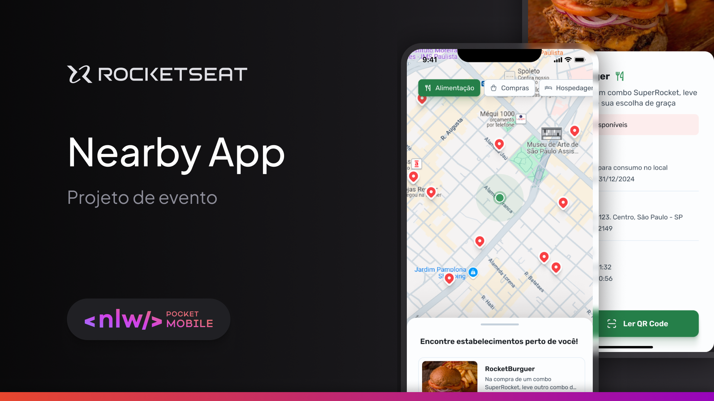

# Nearby

# Next Level Week

A **Next Level Week** é um evento gratuito de programação na prática da Rocketseat, com o objetivo de desenvolver um projeto completo em uma semana, aprendendo novas tecnologias, desenvolvendo novas habilidades e evoluindo para o próximo nível como desenvolvedor.

## O projeto

**Nearby** é uma aplicação mobile de clube de benefícios, e é o projeto desenvolvido durante a **NLW Pocket Mobile**.



## Funcionalidades

A aplicação desenvolvida contém as seguintes funcionalidades:

- Listar estabelecimentos parceiros próximos no mapa
- Apresentar informações sobre o estabelecimento selecionado
- Escanear QR Code para usar um cupom disponível

## Tecnologias

O presente projeto foi desenvolvido na trilha Kotlin do evento, utilizando tecnologias como:

- Kotlin
- Jetpack Compose
- Google Maps Compose
- Coil
- Navigation Compose
- Ktor
- Zxing
- Android Studio

## Configurações Necessárias

Para o funcionamento da aplicação é necessário inserir uma chave de API do Google Maps válida.

Abra o arquivo `AndroidManifest.xml` e procure por:

```xml
<meta-data
    android:name="com.google.android.geo.API_KEY"
    android:value="YOUR_API_KEY" />
```

Substitua `YOUR_API_KEY` pela sua chave de API (Necessário criar o projeto no console do Google Maps Platform)

### Para executar em Dispositivo Físico

No arquivo `res/xml/network_security_config.xml`, procure por:

```xml
<!--A linha abaixo é para conexão com a API através de dispositivo físico - NECESSÁRIO INSERIR O IP DA MÁQUINA-->
<domain includeSubdomains="true">0.0.0.0</domain>
```

Altere `0.0.0.0` pelo IP do computador onde será executado o backend (Próxima seção)

No arquivo `NearbyRemoteDataSource.kt` dentro de `core.network` procure por:

```kt
private const val LOCAL_HOST_PHYSICAL_BASE_URL =
        "http://0.0.0.0:3333" // TODO: Alterar para o IP da máquina que está executando a API
```

Altere `0.0.0.0` pelo IP do computador onde será executado o backend (Igual ao arquivo anterior)

### Para executar em Emulador

No arquivo `NearbyRemoteDataSource.kt` dentro de `core.network` procure por:

```kt
//    private const val BASE_URL = LOCAL_HOST_EMULATOR_BASE_URL
private const val BASE_URL = LOCAL_HOST_PHYSICAL_BASE_URL
```

Altere para:

```kt
private const val BASE_URL = LOCAL_HOST_EMULATOR_BASE_URL
//private const val BASE_URL = LOCAL_HOST_PHYSICAL_BASE_URL
```

> IMPORTANTE: Para testar a funcionalidade de escanear o QR Code é necessário executar o projeto em um dispositivo físico.

## Executando o projeto

Este projeto depende de um backend para funcionar corretamente.

### Executando o backend

Dentro da pasta do projeto, no diretório `_api`, extraia o arquivo `api.zip`

Com os arquivos extraídos, execute os comandos:

```bash
cd api/
npm i
npm run dev
```

> IMPORTANTE: É necessário ter o NodeJS instalado.

Com o backend em execução basta executar o aplicativo através do Android Studio para instalar no Emulador ou Dispositivo Físico